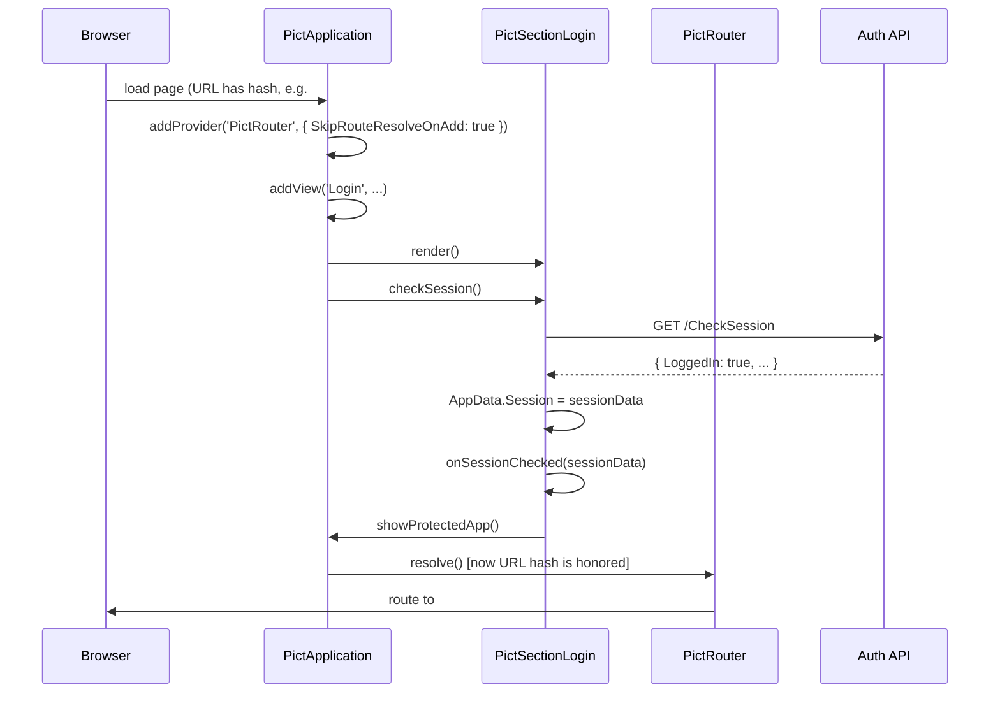
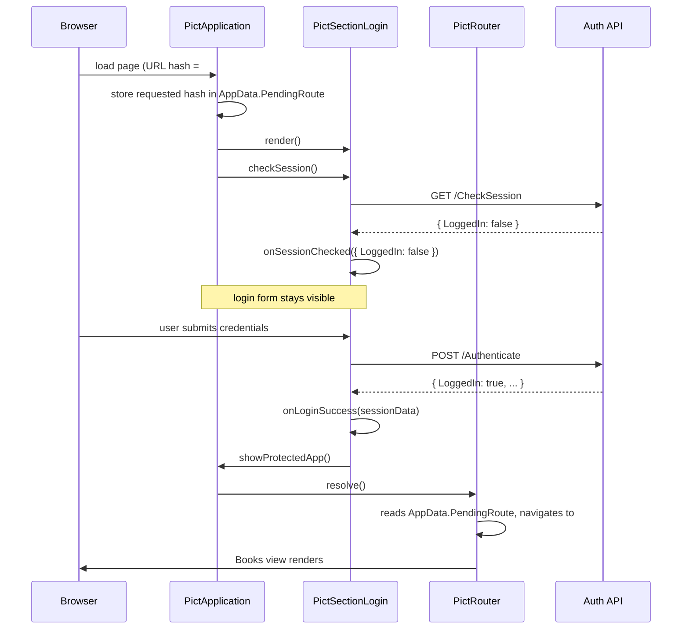

# Router Integration

This guide shows how to use `pict-section-login` together with [pict-router](https://github.com/stevenvelozo/pict-router) to build an application where:

- Routes are hash-based (`#/Dashboard`, `#/Books`, `#/Users/42/Edit`)
- Unauthenticated users are shown the login form instead of the route's content
- After a successful login, the user is redirected back to the route they originally requested
- Refreshing the page in the middle of a protected route transparently restores the session and stays on the route

The pattern is derived from the `example_applications/harness_app` example in this repo.

## The Core Idea

`pict-section-login` does not implement route guards directly. Instead, it gives you everything you need to implement them yourself in a handful of lines:

1. The login view exposes `checkSession()` and an `onSessionChecked` hook.
2. The login view writes the session to a manifest address (default `AppData.Session`) that anyone can read.
3. `pict-router` supports `SkipRouteResolveOnAdd: true` so you can delay route resolution until after the session check has landed.
4. The pending-route redirect is implemented by writing the requested path to `AppData.PendingRoute` whenever an unauthenticated user hits a protected route, and reading it back from `onLoginSuccess`.

## Flow Diagram



Or, in the unauthenticated branch:



## Step-by-Step Setup

### 1. Configure the Router With `SkipRouteResolveOnAdd`

Write a JSON provider config that tells `pict-router` to register routes but not invoke them yet:

```json
{
	"ProviderIdentifier":    "Pict-Router",
	"SkipRouteResolveOnAdd": true,
	"Routes":
	[
		{
			"path":     "/Dashboard",
			"template": "{~LV:Pict.PictApplication.showView(`HarnessApp-Dashboard`)~}"
		},
		{
			"path":     "/Books",
			"template": "{~LV:Pict.PictApplication.showView(`HarnessApp-Books`)~}"
		},
		{
			"path":     "/Users",
			"template": "{~LV:Pict.PictApplication.showView(`HarnessApp-Users`)~}"
		}
	]
}
```

### 2. Register the Router and the Login View

```javascript
const libPictApplication = require('pict-application');
const libPictRouter      = require('pict-router');
const HarnessAppLoginView = require('./views/HarnessAppLoginView');

class HarnessApp extends libPictApplication
{
	constructor(pFable, pOptions, pServiceHash)
	{
		super(pFable, pOptions, pServiceHash);

		this.pict.addProvider(
			'PictRouter',
			require('./providers/PictRouter-HarnessApp.json'),
			libPictRouter);

		this.pict.addView(
			'HarnessApp-Login',
			HarnessAppLoginView.default_configuration,
			HarnessAppLoginView);

		// ... other views
	}
}
```

### 3. Capture the Requested Route Before Anything Else

Before rendering either the login form or the protected shell, capture the hash the browser arrived with. Do this as early as possible -- ideally in the application constructor or at the very top of `onAfterInitializeAsync`.

```javascript
onAfterInitializeAsync(fCallback)
{
	// Capture the originally requested route
	const tmpHash = (window.location.hash || '').replace(/^#/, '');
	if (tmpHash && tmpHash !== '/')
	{
		this.pict.AppData.PendingRoute = tmpHash;
	}

	// Render the login form and check session
	this.pict.views['HarnessApp-Login'].render();
	this.pict.CSSMap.injectCSS();
	this.pict.views['HarnessApp-Login'].checkSession();

	if (fCallback) fCallback();
}
```

### 4. Show the Protected Shell When Authenticated

The login view's `onSessionChecked` hook fires whenever `checkSession()` finishes. Use it to switch to the protected shell if the session is valid:

```javascript
class HarnessAppLoginView extends libPictSectionLogin
{
	onSessionChecked(pSessionData)
	{
		if (pSessionData && pSessionData.LoggedIn)
		{
			this.pict.PictApplication?.showProtectedApp?.();
		}
	}

	onLoginSuccess(pSessionData)
	{
		this.pict.PictApplication?.showProtectedApp?.();
	}
}
```

### 5. Resolve the Router After the Shell Renders

`showProtectedApp` does three things: hide the login container, render the shell, and call `router.resolve()`. Resolving the router at this point honors the current hash -- which is exactly the `PendingRoute` we captured in step 3.

```javascript
showProtectedApp()
{
	document.getElementById('HarnessApp-Login-Container').style.display = 'none';
	document.getElementById('HarnessApp-Container').style.display        = '';

	this.pict.views['HarnessApp-Layout'].render();

	// Honor the stored pending route, if any
	const tmpPending = this.pict.AppData.PendingRoute;
	if (tmpPending)
	{
		this.pict.AppData.PendingRoute = null;
		this.pict.providers.PictRouter.navigate(tmpPending);
	}
	else
	{
		this.pict.providers.PictRouter.resolve();
	}
}
```

`navigate(tmpPending)` pushes the hash and invokes the matching route handler. `resolve()` honors whatever hash is currently in the URL (which, if we did not store a pending route, is the default landing route).

### 6. Handle Logout

`pict-section-login` clears `authenticated`, `sessionData`, and the manifest address for you. All that is left is to swap the UI back:

```javascript
class HarnessAppLoginView extends libPictSectionLogin
{
	onLogout()
	{
		this.pict.PictApplication?.showLogin?.();
	}
}
```

And in the application:

```javascript
showLogin()
{
	document.getElementById('HarnessApp-Container').style.display        = 'none';
	document.getElementById('HarnessApp-Login-Container').style.display  = '';
	this.pict.views['HarnessApp-Login'].render();

	// Optional: clear the hash so the URL reflects the unauthenticated state
	history.replaceState(null, '', window.location.pathname + window.location.search);
}
```

## Guarding Individual Routes

Sometimes you want *some* routes to be public (`#/`, `#/About`, `#/Pricing`) and *others* to require authentication. The cleanest approach is to guard at the route handler level. Wrap each protected route in a small helper:

```javascript
function requireAuth(pApplication, pProtectedAction)
{
	return function routeHandler()
	{
		if (pApplication.pict.AppData.Session?.LoggedIn)
		{
			pProtectedAction();
		}
		else
		{
			// Remember where the user was trying to go
			pApplication.pict.AppData.PendingRoute = window.location.hash.replace(/^#/, '');
			pApplication.showLogin();
		}
	};
}
```

Then register your routes with it:

```javascript
const tmpRouter = this.pict.providers.PictRouter;

tmpRouter.addRoute('/',         () => this.pict.views.PublicHome.render());
tmpRouter.addRoute('/About',    () => this.pict.views.PublicAbout.render());
tmpRouter.addRoute('/Dashboard', requireAuth(this, () => this.pict.views.Dashboard.render()));
tmpRouter.addRoute('/Books',     requireAuth(this, () => this.pict.views.Books.render()));
tmpRouter.addRoute('/Users',     requireAuth(this, () => this.pict.views.Users.render()));
```

Now an unauthenticated visit to `#/Books`:

1. Hits the protected route's handler.
2. Fails the `Session.LoggedIn` check.
3. Writes `Books` to `AppData.PendingRoute`.
4. Calls `showLogin()` to display the login form.
5. After the user signs in, `onLoginSuccess` → `showProtectedApp` → `navigate(AppData.PendingRoute)` lands them back on `#/Books`.

## Post-Login Redirect in One Helper

To keep the pending-route logic in a single place, put it on the login view itself:

```javascript
class HarnessAppLoginView extends libPictSectionLogin
{
	afterAuthenticated()
	{
		const tmpPending = this.pict.AppData.PendingRoute;
		if (tmpPending && this.pict.providers.PictRouter)
		{
			this.pict.AppData.PendingRoute = null;
			this.pict.PictApplication?.showProtectedApp?.();
			this.pict.providers.PictRouter.navigate(tmpPending);
		}
		else
		{
			this.pict.PictApplication?.showProtectedApp?.();
			this.pict.providers.PictRouter?.resolve();
		}
	}

	onLoginSuccess(pSessionData)    { this.afterAuthenticated(); }
	onSessionChecked(pSessionData)
	{
		if (pSessionData && pSessionData.LoggedIn) this.afterAuthenticated();
	}
}
```

This works the same whether the user is:

- Loading the app for the first time and a cookie restores the session (`onSessionChecked` path)
- Loading the app for the first time and entering credentials (`onLoginSuccess` path)
- Returning from a logout and signing back in (`onLoginSuccess` path)

## Best Practices

- **Always set `SkipRouteResolveOnAdd: true`.** Without it, the router resolves as soon as routes are added, which is typically before the session check has completed.
- **Capture the pending route before rendering anything.** The hash is readable from `window.location.hash` immediately; stash it in `AppData.PendingRoute` in the constructor or at the very top of `onAfterInitializeAsync`.
- **Store pending routes under a single known key.** `AppData.PendingRoute` is a convention, not a requirement, but picking one key everywhere keeps the redirect logic easy to audit.
- **Clear the pending route after you honor it.** Otherwise a subsequent navigation may redirect to a stale destination.
- **Guard at the route handler, not inside the views.** The view should not know whether it is protected. Protecting a view inside `render()` scatters the auth logic and makes public views impossible.
- **Never render protected content before `checkSession()` resolves.** Either set `CheckSessionOnLoad: true` and let the view do it, or set it to `false` and call `checkSession()` yourself before resolving the router.
- **Use `router.navigate(pRoute)` for post-login redirects, not `window.location.hash = ...`.** Navigate runs the matched route's handler and updates the hash atomically; setting the hash directly skips the handler on some navigation-capture setups.
- **For deep-linkable public routes, check `AppData.Session` inside the route template if you want per-route conditional rendering.** Route templates can read any manifest address.

## Full Reference Application

`example_applications/harness_app` inside this repo is a complete working implementation of everything on this page. It contains:

- `Harness-App-Application.js` -- the application class with `showProtectedApp`, `showLogin`, `navigateTo`, `doLogout`
- `providers/PictRouter-HarnessApp.json` -- the router configuration with `SkipRouteResolveOnAdd: true`
- `views/PictView-HarnessApp-Login.js` -- the login view subclass with `onSessionChecked` / `onLoginSuccess` overrides
- `views/PictView-HarnessApp-*.js` -- the protected shell, top bar, dashboard, books, and users views
- `html/index.html` -- the dual-container HTML layout

Start there if you want a copy-pasteable template.
